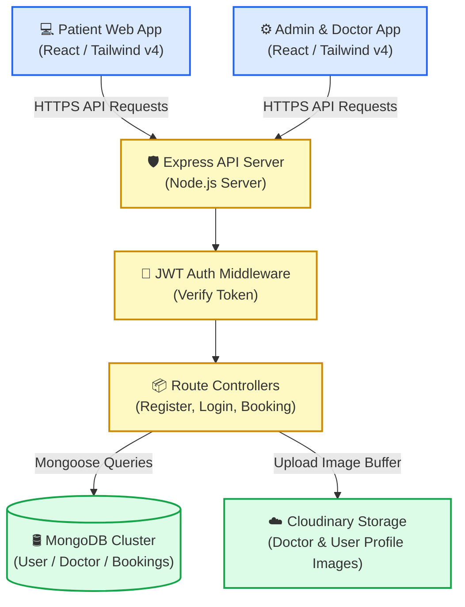
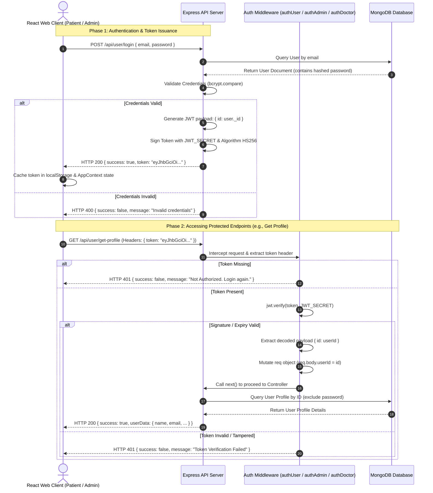

# DocHome 🩺

DocHome is a modern, full-stack doctor appointment booking platform designed to connect patients, doctors, and administrators seamlessly. It features a complete patient portal, a dedicated admin control panel, and a robust REST API backend.

---

## 🔗 Live Deployments

*   **Patient Portal:** [https://dochome-1.onrender.com](https://dochome-1.onrender.com)
*   **Admin & Doctor Portal:** [https://dochome-admin-nrm4.onrender.com](https://dochome-admin-nrm4.onrender.com)

---

## 📐 High-Level Design (HLD)

DocHome uses a multi-tier Client-Server architecture. The React applications communicate with a centralized Node.js/Express REST API backend that handles database operations, security (authentication & tokens), and media uploads.

### **Architecture Overview & Data Flow**



### **Component Responsibility**
*   **Web Clients (Frontend & Admin):** Handles authentication state (localStorage token), user interface layout, form validations, dynamic slot selections, and responsive viewport sizing.
*   **API Gateway & Controller (Backend):** Mounts sub-routers (`admin`, `doctor`, `user`), implements CORS and URL cleaning middleware, hashes passwords with `bcrypt`, generates and validates JSON Web Tokens (`jwt`), and handles image file streaming to Cloudinary via Multer memory buffers.
*   **Database (MongoDB):** Relational collection modeling via Mongoose (e.g. referencing Doctor IDs in user Appointments) and schema-level index optimization.

---

## 📌 Table of Contents

- [🔗 Live Deployments](#-live-deployments)
- [📐 High-Level Design (HLD)](#-high-level-design-hld)
- [🚀 Features](#-features)
- [🛠️ Technology Stack](#️-technology-stack)
- [📂 Project Structure](#-project-structure)
- [🔑 Authentication System](#-authentication-system)
- [⚙️ Environment Configuration](#️-environment-configuration)
- [🏃 Getting Started](#-getting-started)
- [🔒 Security & Optimization Best Practices](#-security--optimization-best-practices)

---

## 🚀 Features

### **Patient Portal (Frontend)**
*   **Search & Filter:** Find doctors instantly by specialty or category.
*   **Appointment Booking:** Select specific dates and active time slots to schedule appointments.
*   **Profile Management:** Edit personal details and upload profile photos securely (stored on Cloudinary).
*   **Appointment History:** Track, view, or cancel upcoming and past appointments.
*   **Premium UX:** Humanised page-loading transitions, button spinners during submissions, and fullscreen logout overlays with backdrop blur.

### **Admin & Doctor Portal (Admin)**
*   **Admin Dashboard:** Add new doctors, configure parameters, and review system-wide bookings.
*   **Doctor Panel:** Manage appointments, view patients, and update doctor profiles.
*   **Doctor Listings:** Control doctor availability switches.

### **API Backend (Server)**
*   **Authentication & Authorization:** Secure user/doctor/admin login using JWT and encrypted passwords (bcrypt).
*   **File Uploads:** Integrated with Cloudinary and Multer for processing image files.
*   **Database Management:** Fast and structured queries using MongoDB and Mongoose.

---

## 🛠️ Technology Stack

*   **Frontend & Admin Panel:** React, Vite, React Router, Tailwind CSS, React Toastify, Axios
*   **Backend:** Node.js, Express.js, MongoDB, Mongoose
*   **Cloud Services:** Cloudinary (Media assets)

---

## 📂 Project Structure

```
DocHome/
├── Backend/          # Node/Express API, database schemas, and routes
├── frontend/         # Patient-facing React web client
└── admin/            # Combined Admin and Doctor panel client
```

---

## 🔑 Authentication System

DocHome implements a secure, stateless, token-based authentication system utilizing **JSON Web Tokens (JWT)** and **bcrypt** password hashing. The auth architecture prevents database lookups on every incoming request, guaranteeing scalable and fast sub-millisecond API responses.

### **Detailed Authentication & Middleware Flow**



### **Security Controls Implemented**
*   **One-Way Hashing:** Passwords are hashed with salt rounds using `bcrypt` during registration and are never stored in raw text format.
*   **Separated Auth Layers:** Three distinct middlewares isolate contexts:
    *   `authUser.js` - Secures endpoints matching patient actions.
    *   `authDoctor.js` - Secures doctor-specific action routes.
    *   `authAdmin.js` - Authenticates administrative operations (using a predefined admin email/password check).
*   **Stateless Token Verification:** Authenticated routes verify signatures cryptographically using the signature verified with `process.env.JWT_SECRET`, meaning no session lookups are made to the database.

---

## ⚙️ Environment Configuration

You need to set up `.env` files for each component to connect the services.

### **1. Backend Environment Setup (`Backend/.env`)**
Create a `.env` file in the `Backend/` directory:
```env
PORT=4000
MONGODB_URI=your_mongodb_connection_string
JWT_SECRET=your_jwt_secret_key
CLOUDINARY_NAME=your_cloudinary_cloud_name
CLOUDINARY_API_KEY=your_cloudinary_api_key
CLOUDINARY_API_SECRET=your_cloudinary_api_secret
ADMIN_EMAIL=admin@dochome.com
ADMIN_PASSWORD=your_admin_password
```

### **2. Frontend Environment Setup (`frontend/.env`)**
Create a `.env` file in the `frontend/` directory:
```env
VITE_BACKEND_URL=http://localhost:4000
```

### **3. Admin Environment Setup (`admin/.env`)**
Create a `.env` file in the `admin/` directory:
```env
VITE_BACKEND_URL=http://localhost:4000
```

---

## 🏃 Getting Started

### **Prerequisites**
Make sure you have [Node.js](https://nodejs.org/) and [npm](https://www.npmjs.com/) installed.

### **1. Setup the Backend**
```bash
cd Backend
npm install
# To run in production mode
npm start
# Or to run in development mode (if nodemon is installed)
npm run dev
```

### **2. Setup the Frontend Client**
```bash
cd frontend
npm install
npm run dev
```
Open `http://localhost:5173` (or the port specified by Vite) in your browser.

### **3. Setup the Admin Portal**
```bash
cd admin
npm install
npm run dev
```
Open `http://localhost:5174` (or the port specified by Vite) in your browser.

---

## 🔒 Security & Optimization Best Practices

*   **Lean Mongoose Queries:** Utilizing `.lean()` for read-only queries to bypass model hydration and save backend memory.
*   **Secure API Routers:** API inputs are validated, and secure headers are recommended for production setups.
*   **Dynamic Image Optimization:** Cloudinary URLs are queried using format and quality automation parameters to minimize bundle loads.
